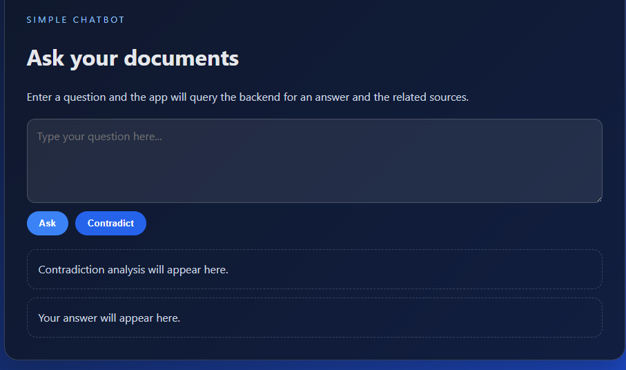
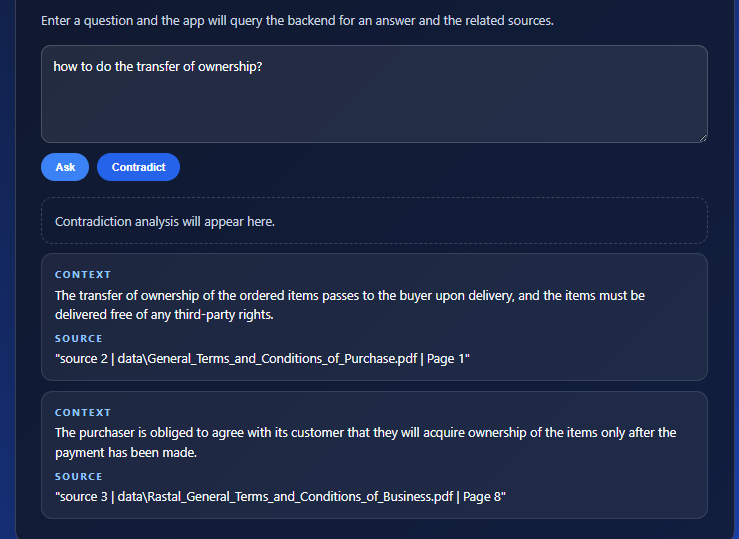
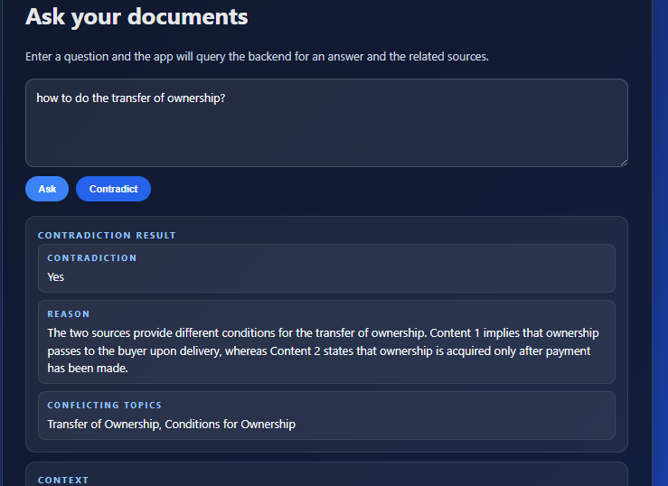

# potens-intern-AI/ML-chaitanya-powar
# RAG-based Document Question Answering System with Citations

## Overview

This project is a Retrieval-Augmented Generation (RAG) application that allows users to ask questions about a collection of PDF documents. Instead of relying on the LLM's internal knowledge, the system retrieves the most relevant document chunks from a vector database and uses them as context for answer generation.

The application consists of:

* **Frontend:** React (Vite)
* **Backend:** Flask
* **Vector Database:** ChromaDB
* **Embedding Model:** sentence-transformers/all-MiniLM-L6-v2
* **LLM:** Groq (Llama 3.3 70B Versatile)
* **Document Loader:** PyMuPDFLoader (LangChain)

---

# Features

* Ask questions about uploaded PDF documents.
* Retrieval-Augmented Generation (RAG).
* Source citations for every generated answer.
* Multi-document retrieval.
* Automatic document chunking.
* Embedding generation using HuggingFace sentence transformers.
* Chroma vector database persistence.
* Basic answer contradiction/consistency checker.
* React frontend with Flask backend.

---

# Project Structure

```
.
├── app.py
├── utils.py
├── data/
│   └── *.pdf
├── chroma_langchain_db/
├── frontend/
│   ├── src/
│   └── package.json
├── requirements.txt
└── README.md
```

---

# Installation

## 1. Clone the repository

```bash
git clone <repository_url>
cd <repository_name>
```

---

## 2. Create a virtual environment

Windows

```bash
python -m venv .venv
.venv\Scripts\activate
```

Linux/macOS

```bash
python3 -m venv .venv
source .venv/bin/activate
```

---

## 3. Install dependencies

```bash
pip install -r requirements.txt
```

---

## 4. Create a `.env`

```
GROQ_API_KEY=your_groq_api_key
```

---

## 5. Install frontend dependencies

```
cd frontend
npm install
```

---

# Running the Project

## Start the backend

```bash
python app.py
```

Backend runs on:

```
http://localhost:5000
```

---

## Start the frontend

```bash
cd frontend
npm run dev
```

Frontend runs on:

```
http://localhost:3000
```

---

# First Run

On the first run the backend:

1. Loads every PDF from the `data/` directory.
2. Splits documents into chunks.
3. Generates embeddings.
4. Stores embeddings inside ChromaDB.

Subsequent runs reuse the persisted vector database instead of rebuilding it.

If the document collection changes, delete the existing `chroma_langchain_db/` directory and restart the backend to rebuild the index.

---

# API

## POST /ask

Request

```json
{
    "query":"Who is responsible for delivery?"
}
```

Response

```json
{
    "answer":"..."
}
```

---

## POST /contradict

Request

```json
{
    "contents":[
        "Question",
        "Generated Answer"
    ]
}
```

Response

```json
{
    "result":"..."
}
```

---

# Retrieval Pipeline

```
User Question
      │
      ▼
Generate Embedding
      │
      ▼
Similarity Search (Chroma)
      │
      ▼
Top-k Relevant Chunks
      │
      ▼
Prompt Construction
      │
      ▼
Groq LLM
      │
      ▼
Answer + Citations
```

---

# Design Decisions

## Retrieval-Augmented Generation

The LLM is restricted to answering only from retrieved document context instead of relying on pretrained knowledge. This minimizes hallucinations and makes every response traceable back to the source documents.

---

## ChromaDB

Chroma was selected because it is lightweight, integrates well with LangChain, and supports persistent local storage without requiring a separate database server.

---

## Sentence Transformer Embeddings

The project uses:

```
sentence-transformers/all-MiniLM-L6-v2
```

This model provides a good trade-off between retrieval quality, inference speed, and memory usage for CPU-based development.

---

## Recursive Character Splitting

Documents are split using overlapping chunks.

Reasons:

* improves semantic retrieval
* preserves context between chunks
* reduces the chance of losing important information at chunk boundaries

---

## Source Citations

Each retrieved chunk carries metadata including:

* source filename
* page number
* internal source id

These metadata are injected into the prompt so that generated answers include citations.

---

## Prompt Engineering

The prompt explicitly instructs the LLM to:

* answer only from retrieved context
* avoid outside knowledge
* avoid duplicate answers
* merge identical facts
* return structured answer/source pairs

---

# Non-obvious Code Decisions

The following parts of the code contain comments because they are not immediately obvious:

* Chroma database initialization only indexes documents when the persistent database is empty. This prevents duplicate embeddings from being inserted on every application restart.

* Retrieved document chunks are formatted into a human-readable structure before being sent to the LLM. Passing raw Python dictionaries produced poorer responses than structured text.

* Source metadata (filename and page) are preserved throughout retrieval so citations can be generated without additional lookups.

* The retrieval stage and generation stage are intentionally separated. This makes it easier to replace either the embedding model or the LLM independently.

---

# Limitations / Unfinished Work

The project is functional but several areas remain for improvement.

## Duplicate Retrieval

Very similar chunks can occasionally be retrieved from the same document because of overlapping chunk boundaries.

A future improvement would deduplicate retrieved chunks before prompting the LLM.

---

## Prompt-only Citation Generation

The LLM generates citations based on metadata included in the prompt.

There is currently no automatic verification that every citation corresponds exactly to the generated statement.

---

## Contradiction Checker

The contradiction endpoint currently compares a question with a generated answer.

A more useful implementation would compare:

* two answers,
* two document passages,
* or two retrieved contexts.

---

## Incremental Index Updates

Whenever documents change, the current implementation rebuilds the vector database manually.

An automatic synchronization mechanism would improve usability.

---

## No Conversation Memory

Each request is independent.

The application does not maintain conversational history or multi-turn context.

---

## Retrieval Parameters

The retrieval configuration (chunk size, overlap, top-k) is currently fixed.

These should eventually become configurable.

---

# Future Improvements

* Hybrid Retrieval (BM25 + Dense Retrieval)
* Cross-Encoder reranking
* Streaming responses
* Multi-turn conversational memory
* Citation verification
* Upload PDFs from the UI
* Automatic vector database refresh
* Better contradiction detection using retrieved evidence
* Answer confidence scores
* Source highlighting inside the original PDF
* Docker deployment
* Unit and integration tests
* User authentication
* Support for additional document formats (Word, PowerPoint, HTML)

---

# Technologies Used

* Python
* Flask
* React
* Vite
* LangChain
* ChromaDB
* HuggingFace Transformers
* Sentence Transformers
* Groq API
* PyMuPDF

---

## AI Use Log

The following AI tools and resources were used during the development of this project.

* **ChatGPT** (~25–30 messages)
  Used for frontend+backend integration, prompt engineering, debugging backend development with Flask, debugging, retrieval tuning, citation generation, and preparing the project documentation.

* **GitHub Copilot (VS Code)** (~10–15 code completions)
  Used primarily for frontend development. The React frontend, including most of the UI components and styling, was designed with the assistance of Copilot.

* **LangChain Documentation** (~6–8 documentation pages/references)
  Used as the primary reference for LangChain APIs, document loaders, Chroma vector store integration, embeddings, retrievers, and other framework-specific functionality.

* **YouTube Tutorials** (~1–3 videos)
  Used to understand Retrieval-Augmented Generation (RAG), LangChain workflows, ChromaDB, and overall project architecture before implementation.

### Notes

* AI-generated suggestions were reviewed, modified, integrated, and debugged before being incorporated into the project.
* Documentation and tutorials were used as learning resources and API references throughout development.




